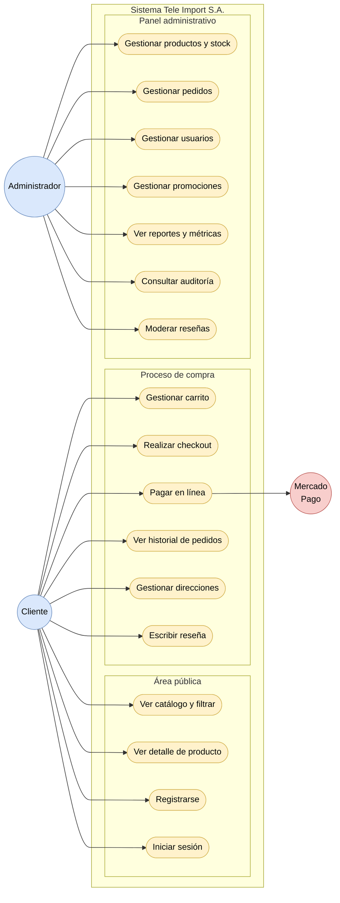
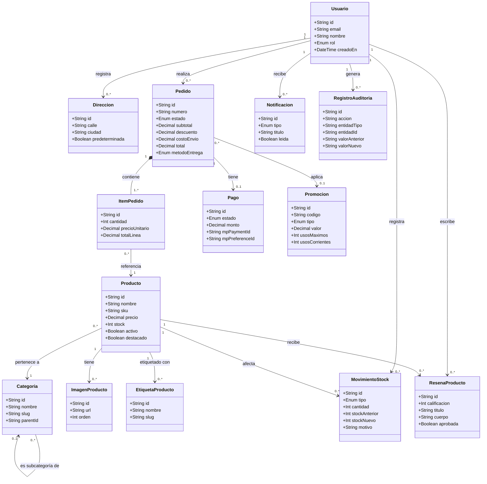
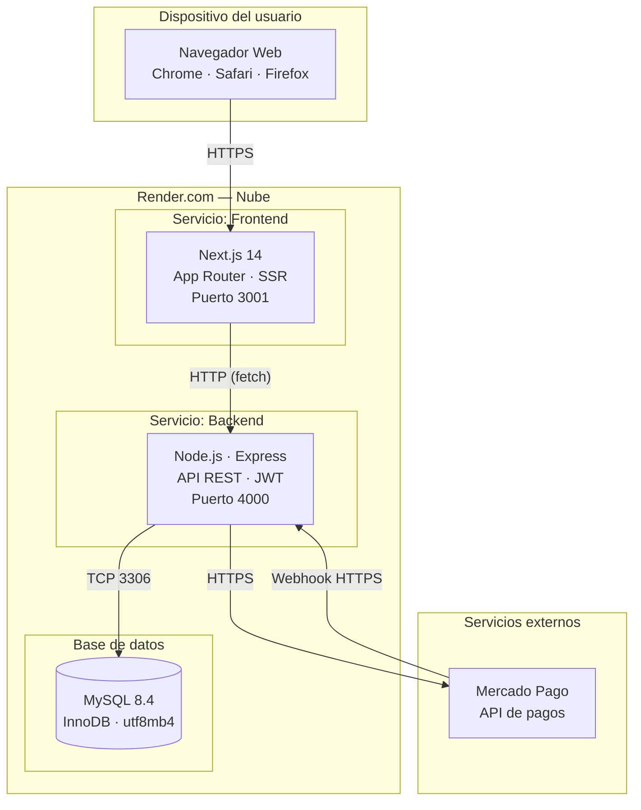
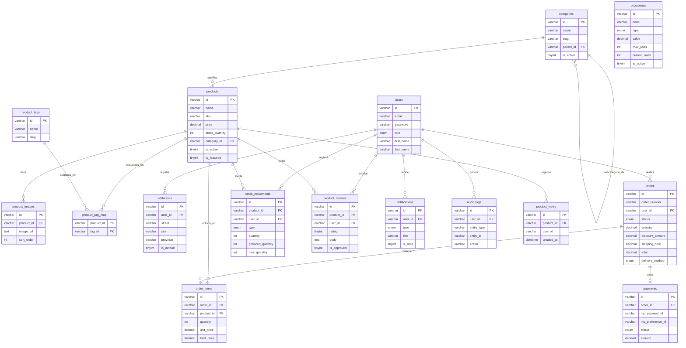

# Diagramas Mermaid — Tesis Tele Import S.A.

> Copiar cada bloque en [mermaid.live](https://mermaid.live) para renderizarlo.

---

## 1. Diagrama general de casos de uso

---

## 2. Diagrama de clases conceptual

---

## 3. Diagrama de despliegue

---

## 4. Diagrama entidad-relación simplificado

