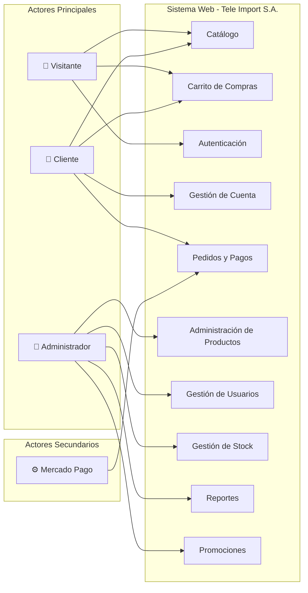

# Casos de Uso del Sistema — Tele Import S.A.

## Modelado Funcional del Sistema Web de Gestión Comercial

---

## 1. Identificación de Actores

### 1.1. Actores Principales

Los actores principales son aquellos que inician las interacciones con el sistema y obtienen un valor directo de su uso.

| Actor | Descripción | Nivel de acceso |
|---|---|---|
| **Visitante** | Persona que accede al sitio web sin haber iniciado sesión. Puede navegar el catálogo y gestionar un carrito temporal, pero no puede concretar compras ni acceder a funcionalidades que requieran identificación. | Público (sin autenticación) |
| **Cliente** | Usuario registrado que ha iniciado sesión en el sistema. Puede realizar compras, gestionar su perfil, consultar su historial de pedidos y administrar sus direcciones de entrega. | Autenticado (rol `customer`) |
| **Administrador** | Personal autorizado del negocio con acceso al panel de gestión. Puede administrar productos, categorías, stock, pedidos, usuarios, promociones y acceder a reportes comerciales. | Autenticado (rol `admin`) |

### 1.2. Actores Secundarios

Los actores secundarios participan de forma indirecta en los casos de uso, generalmente como sistemas externos que proveen o reciben información.

| Actor | Descripción | Tipo |
|---|---|---|
| **Mercado Pago** | Pasarela de pagos externa que procesa las transacciones monetarias de los pedidos. Recibe solicitudes de cobro y notifica al sistema sobre el resultado del pago mediante webhooks. | Sistema externo |
| **Base de datos** | Motor de persistencia SQLite que almacena todas las entidades del dominio. Participa de forma implícita en todos los casos de uso que involucran lectura o escritura de datos. | Sistema interno |

### 1.3. Diagrama de Actores y Módulos

---

## 2. Catálogo de Casos de Uso por Módulo

A continuación se enumeran los casos de uso identificados, organizados por área funcional del sistema. Cada caso de uso se identifica con un código compuesto por las siglas del módulo y un número secuencial.

### 2.1. Módulo de Catálogo (CAT)

| Código | Caso de uso | Actor principal | Prioridad |
|---|---|---|---|
| CAT-01 | Consultar catálogo de productos | Visitante / Cliente | Alta |
| CAT-02 | Filtrar productos por criterios | Visitante / Cliente | Alta |
| CAT-03 | Consultar detalle de un producto | Visitante / Cliente | Alta |
| CAT-04 | Visualizar productos destacados | Visitante / Cliente | Media |

### 2.2. Módulo de Carrito de Compras (CAR)

| Código | Caso de uso | Actor principal | Prioridad |
|---|---|---|---|
| CAR-01 | Agregar producto al carrito | Visitante / Cliente | Alta |
| CAR-02 | Modificar cantidad de un ítem del carrito | Visitante / Cliente | Alta |
| CAR-03 | Eliminar producto del carrito | Visitante / Cliente | Media |
| CAR-04 | Aplicar cupón de descuento al carrito | Cliente | Media |

### 2.3. Módulo de Autenticación (AUT)

| Código | Caso de uso | Actor principal | Prioridad |
|---|---|---|---|
| AUT-01 | Registrarse como cliente | Visitante | Alta |
| AUT-02 | Iniciar sesión | Visitante | Alta |
| AUT-03 | Cerrar sesión | Cliente / Administrador | Baja |

### 2.4. Módulo de Gestión de Cuenta (CUE)

| Código | Caso de uso | Actor principal | Prioridad |
|---|---|---|---|
| CUE-01 | Editar datos del perfil | Cliente | Media |
| CUE-02 | Gestionar direcciones de envío | Cliente | Alta |
| CUE-03 | Consultar historial de pedidos | Cliente | Alta |
| CUE-04 | Consultar detalle de un pedido propio | Cliente | Alta |

### 2.5. Módulo de Pedidos y Pagos (PED)

| Código | Caso de uso | Actor principal | Prioridad |
|---|---|---|---|
| PED-01 | Realizar un pedido | Cliente | Alta |
| PED-02 | Procesar pago mediante Mercado Pago | Cliente | Alta |
| PED-03 | Recibir notificación de resultado de pago | Mercado Pago | Alta |

### 2.6. Módulo de Administración de Productos (APR)

| Código | Caso de uso | Actor principal | Prioridad |
|---|---|---|---|
| APR-01 | Crear un producto | Administrador | Alta |
| APR-02 | Editar un producto | Administrador | Alta |
| APR-03 | Activar o desactivar un producto | Administrador | Media |
| APR-04 | Eliminar un producto | Administrador | Media |

### 2.7. Módulo de Gestión de Usuarios (GUS)

| Código | Caso de uso | Actor principal | Prioridad |
|---|---|---|---|
| GUS-01 | Consultar listado de usuarios | Administrador | Media |
| GUS-02 | Cambiar el rol de un usuario | Administrador | Media |
| GUS-03 | Eliminar un usuario | Administrador | Baja |

### 2.8. Módulo de Gestión de Stock (STK)

| Código | Caso de uso | Actor principal | Prioridad |
|---|---|---|---|
| STK-01 | Registrar movimiento de stock | Administrador | Alta |
| STK-02 | Consultar historial de movimientos de un producto | Administrador | Media |

### 2.9. Módulo de Reportes (REP)

| Código | Caso de uso | Actor principal | Prioridad |
|---|---|---|---|
| REP-01 | Consultar métricas globales del dashboard | Administrador | Alta |
| REP-02 | Generar reporte de ventas por período | Administrador | Alta |
| REP-03 | Consultar productos más vendidos | Administrador | Media |
| REP-04 | Consultar productos menos vendidos | Administrador | Media |

### 2.10. Módulo de Promociones (PRO)

| Código | Caso de uso | Actor principal | Prioridad |
|---|---|---|---|
| PRO-01 | Crear un cupón de descuento | Administrador | Media |

---

## 3. Diagrama General de Casos de Uso

```mermaid
graph TB
    subgraph "Actores"
        Visitante["🧑 Visitante"]
        Cliente["🧑 Cliente"]
        Admin["🧑 Administrador"]
        MP["⚙️ Mercado Pago"]
    end

    subgraph "Catálogo"
        CAT01["CAT-01: Consultar catálogo"]
        CAT02["CAT-02: Filtrar productos"]
        CAT03["CAT-03: Consultar detalle de producto"]
        CAT04["CAT-04: Ver productos destacados"]
    end

    subgraph "Carrito"
        CAR01["CAR-01: Agregar producto al carrito"]
        CAR02["CAR-02: Modificar cantidad"]
        CAR03["CAR-03: Eliminar producto del carrito"]
        CAR04["CAR-04: Aplicar cupón"]
    end

    subgraph "Autenticación"
        AUT01["AUT-01: Registrarse"]
        AUT02["AUT-02: Iniciar sesión"]
    end

    subgraph "Cuenta del Cliente"
        CUE01["CUE-01: Editar perfil"]
        CUE02["CUE-02: Gestionar direcciones"]
        CUE03["CUE-03: Consultar historial de pedidos"]
    end

    subgraph "Pedidos y Pagos"
        PED01["PED-01: Realizar pedido"]
        PED02["PED-02: Procesar pago"]
        PED03["PED-03: Recibir notificación de pago"]
    end

    subgraph "Administración"
        APR01["APR-01: Crear producto"]
        APR02["APR-02: Editar producto"]
        APR03["APR-03: Activar/desactivar producto"]
        GUS01["GUS-01: Consultar usuarios"]
        GUS02["GUS-02: Cambiar rol de usuario"]
        STK01["STK-01: Registrar movimiento de stock"]
        REP01["REP-01: Consultar métricas"]
        REP02["REP-02: Reporte de ventas"]
        PRO01["PRO-01: Crear cupón"]
    end

    Visitante --> CAT01
    Visitante --> CAT02
    Visitante --> CAT03
    Visitante --> CAT04
    Visitante --> CAR01
    Visitante --> AUT01
    Visitante --> AUT02

    Cliente --> CAT01
    Cliente --> CAR01
    Cliente --> CAR02
    Cliente --> CAR03
    Cliente --> CAR04
    Cliente --> CUE01
    Cliente --> CUE02
    Cliente --> CUE03
    Cliente --> PED01
    Cliente --> PED02

    Admin --> APR01
    Admin --> APR02
    Admin --> APR03
    Admin --> GUS01
    Admin --> GUS02
    Admin --> STK01
    Admin --> REP01
    Admin --> REP02
    Admin --> PRO01

    MP --> PED03
```

---

## 4. Desarrollo Detallado de Casos de Uso

---

### CU CAT-01: Consultar catálogo de productos

| Campo | Descripción |
|---|---|
| **Nombre** | Consultar catálogo de productos |
| **Código** | CAT-01 |
| **Objetivo** | Permitir al usuario visualizar el listado de productos disponibles en la tienda, con información resumida de cada uno. |
| **Actor principal** | Visitante / Cliente |
| **Actores secundarios** | Base de datos |
| **Precondiciones** | El sistema se encuentra operativo y existen productos activos con stock cargados en la base de datos. |
| **Postcondiciones** | El usuario visualiza una lista paginada de productos activos con su nombre, imagen principal, precio, marca y disponibilidad de stock. |

**Flujo principal:**

1. El usuario accede a la sección de catálogo del sitio web.
2. El sistema solicita al backend el listado de productos activos mediante la API REST.
3. El backend consulta la base de datos y obtiene los productos activos, ordenados por defecto: primero los que tienen stock disponible, luego por mayor porcentaje de descuento, y finalmente por fecha de creación (más recientes primero).
4. El backend adjunta la imagen principal de cada producto.
5. El sistema presenta los productos en un listado paginado (24 productos por página por defecto).
6. Para cada producto se muestra: nombre, imagen principal, precio vigente, precio anterior (si existe descuento), marca, estado de stock y categoría.
7. El usuario puede navegar entre las páginas del listado.

**Flujos alternativos:**

- **FA1 — No hay productos disponibles:** si la consulta no devuelve resultados, el sistema muestra un mensaje indicando que no se encontraron productos.
- **FA2 — Error de comunicación con el backend:** si la petición al servidor falla, el sistema muestra un mensaje de error y permite al usuario reintentar la carga.

**Reglas de negocio:**

- RN1: Solo se muestran productos cuyo campo `is_active` sea verdadero.
- RN2: Los productos sin stock se muestran al final del listado, indicando visualmente su indisponibilidad.
- RN3: La paginación tiene un máximo de 100 productos por página.

---

### CU CAT-02: Filtrar productos por criterios

| Campo | Descripción |
|---|---|
| **Nombre** | Filtrar productos por criterios |
| **Código** | CAT-02 |
| **Objetivo** | Permitir al usuario refinar el listado de productos aplicando filtros de categoría, rango de precios y búsqueda textual. |
| **Actor principal** | Visitante / Cliente |
| **Actores secundarios** | Base de datos |
| **Precondiciones** | El usuario se encuentra en la página del catálogo de productos. |
| **Postcondiciones** | El listado de productos se actualiza mostrando únicamente los productos que cumplen con todos los filtros aplicados simultáneamente. |

**Flujo principal:**

1. El usuario visualiza el panel de filtros disponible en la página del catálogo.
2. El usuario selecciona uno o más criterios de filtrado:
   - a. Categoría de producto.
   - b. Rango de precios (precio mínimo y precio máximo).
   - c. Término de búsqueda textual.
3. El sistema envía la consulta al backend con los parámetros de filtrado.
4. El backend construye la consulta SQL dinámicamente combinando todas las condiciones de filtrado con operador lógico AND.
5. El sistema actualiza el listado mostrando los productos que satisfacen todos los filtros, manteniendo la paginación.
6. El sistema indica visualmente qué filtros están activos.

**Flujos alternativos:**

- **FA1 — Sin resultados para los filtros aplicados:** el sistema muestra un mensaje informando que no se encontraron productos para la combinación de filtros seleccionada y sugiere modificar los criterios.
- **FA2 — El usuario limpia los filtros:** el usuario remueve uno o todos los filtros activos, y el sistema restaura el listado completo o el listado parcial según los filtros restantes.

**Reglas de negocio:**

- RN1: La búsqueda textual consulta simultáneamente los campos: nombre del producto, descripción, código SKU y marca.
- RN2: Los filtros se aplican de forma acumulativa (intersección lógica).
- RN3: El usuario puede seleccionar un criterio de ordenamiento: más recientes, precio ascendente, precio descendente o nombre alfabético.

---

### CU CAT-03: Consultar detalle de un producto

| Campo | Descripción |
|---|---|
| **Nombre** | Consultar detalle de un producto |
| **Código** | CAT-03 |
| **Objetivo** | Permitir al usuario consultar la información completa de un producto específico. |
| **Actor principal** | Visitante / Cliente |
| **Actores secundarios** | Base de datos |
| **Precondiciones** | El producto existe en la base de datos y se encuentra activo. |
| **Postcondiciones** | El usuario visualiza toda la información del producto: galería de imágenes, descripciones, precio, disponibilidad, marca, modelo y categoría. |

**Flujo principal:**

1. El usuario selecciona un producto desde el catálogo o accede directamente mediante su URL (slug).
2. El sistema solicita al backend el detalle del producto por su slug.
3. El backend consulta el producto en la base de datos, incluyendo el nombre de su categoría mediante un JOIN.
4. El backend adjunta todas las imágenes del producto, ordenadas por su campo `sort_order`.
5. El sistema presenta la página de detalle con:
   - a. Galería de imágenes con navegación.
   - b. Nombre, marca y modelo del producto.
   - c. Precio vigente y, si existe, precio anterior tachado con el porcentaje de descuento.
   - d. Descripción completa y descripción breve.
   - e. Código SKU.
   - f. Estado de disponibilidad (en stock / sin stock).
   - g. Categoría a la que pertenece.
   - h. Botón para agregar al carrito (si hay stock disponible).

**Flujos alternativos:**

- **FA1 — Producto no encontrado:** si el slug no corresponde a ningún producto activo, el sistema muestra una página de error 404 con un mensaje indicando que el producto no fue encontrado.
- **FA2 — Producto sin stock:** si el producto existe pero tiene stock igual a cero, se muestra la información completa pero el botón de agregar al carrito se presenta deshabilitado, indicando que el producto no está disponible.

**Reglas de negocio:**

- RN1: Solo se muestran productos activos (`is_active = 1`).
- RN2: El precio de comparación solo se exhibe si es estrictamente mayor al precio vigente.
- RN3: Las imágenes se muestran en el orden definido por el campo `sort_order`.

---

### CU CAR-01: Agregar producto al carrito

| Campo | Descripción |
|---|---|
| **Nombre** | Agregar producto al carrito |
| **Código** | CAR-01 |
| **Objetivo** | Permitir al usuario incorporar un producto al carrito de compras para su posterior adquisición. |
| **Actor principal** | Visitante / Cliente |
| **Actores secundarios** | Ninguno (operación local en el navegador) |
| **Precondiciones** | El producto está activo y tiene stock disponible mayor a cero. |
| **Postcondiciones** | El producto se incorpora al carrito con la cantidad solicitada. El carrito actualiza sus totales (subtotal, cantidad de ítems, total). Se muestra una confirmación visual al usuario. |

**Flujo principal:**

1. El usuario visualiza un producto con stock disponible (desde el catálogo o la página de detalle).
2. El usuario presiona el botón "Agregar al carrito".
3. El sistema verifica que el producto no supere el stock disponible.
4. El sistema agrega el producto al carrito con cantidad 1 y precio unitario vigente.
5. El sistema recalcula los totales del carrito (subtotal, cantidad total de ítems, total con descuento si aplica).
6. El sistema muestra una notificación visual (toast) confirmando la operación, incluyendo el nombre e imagen del producto.
7. La notificación se oculta automáticamente después de 3 segundos.
8. El estado del carrito se persiste en el almacenamiento local del navegador.

**Flujos alternativos:**

- **FA1 — El producto ya existe en el carrito:** si el producto ya se encuentra en el carrito, el sistema incrementa la cantidad en una unidad en lugar de crear un nuevo ítem, respetando el límite de stock disponible.
- **FA2 — La cantidad alcanza el límite de stock:** si la cantidad solicitada iguala o supera el stock disponible, el sistema ajusta la cantidad al máximo permitido (stock_quantity) sin excederlo.
- **FA3 — Producto sin stock:** si el producto tiene stock igual a cero, el botón permanece deshabilitado y no se permite la acción.

**Reglas de negocio:**

- RN1: La cantidad de un ítem en el carrito nunca puede superar la cantidad de stock disponible del producto (`stock_quantity`).
- RN2: El carrito se gestiona íntegramente en el lado del cliente (almacenamiento local del navegador) y no requiere autenticación.
- RN3: El carrito persiste entre sesiones del navegador y se recupera al recargar la página.

---

### CU CAR-02: Modificar cantidad de un ítem del carrito

| Campo | Descripción |
|---|---|
| **Nombre** | Modificar cantidad de un ítem del carrito |
| **Código** | CAR-02 |
| **Objetivo** | Permitir al usuario ajustar la cantidad de un producto que ya se encuentra en el carrito. |
| **Actor principal** | Visitante / Cliente |
| **Actores secundarios** | Ninguno |
| **Precondiciones** | El carrito contiene al menos un ítem. |
| **Postcondiciones** | La cantidad del ítem se actualiza y los totales del carrito se recalculan. |

**Flujo principal:**

1. El usuario accede a la vista del carrito de compras.
2. El usuario modifica la cantidad de un producto (aumentando o disminuyendo).
3. El sistema verifica que la nueva cantidad no supere el stock disponible del producto.
4. El sistema actualiza la cantidad del ítem.
5. El sistema recalcula el subtotal, el descuento (si hay cupón aplicado) y el total del carrito.

**Flujos alternativos:**

- **FA1 — Cantidad reducida a cero:** si el usuario reduce la cantidad a cero, el sistema elimina el ítem del carrito automáticamente.
- **FA2 — Cantidad supera el stock:** si la cantidad ingresada excede el stock disponible, el sistema ajusta la cantidad al máximo permitido.

**Reglas de negocio:**

- RN1: La cantidad mínima válida para un ítem es 1; por debajo de este valor, el ítem se elimina.
- RN2: La cantidad máxima válida es la cantidad de stock disponible del producto.

---

### CU CAR-04: Aplicar cupón de descuento al carrito

| Campo | Descripción |
|---|---|
| **Nombre** | Aplicar cupón de descuento al carrito |
| **Código** | CAR-04 |
| **Objetivo** | Permitir al cliente ingresar un código de cupón de descuento para obtener una bonificación en su compra. |
| **Actor principal** | Cliente |
| **Actores secundarios** | Base de datos |
| **Precondiciones** | El carrito contiene al menos un ítem. El cliente conoce un código de cupón. |
| **Postcondiciones** | El descuento correspondiente se aplica al carrito y los totales se recalculan. |

**Flujo principal:**

1. El usuario ingresa un código de cupón en el campo habilitado en la vista del carrito.
2. El sistema envía el código al backend para su validación.
3. El backend verifica que el cupón exista, esté activo, se encuentre dentro de su período de vigencia y no haya superado su límite de usos.
4. El backend responde con los datos de la promoción (tipo, valor, condiciones).
5. El sistema calcula el monto de descuento según el tipo de promoción:
   - a. Si es porcentual: aplica el porcentaje sobre el subtotal.
   - b. Si es monto fijo: descuenta el valor indicado, sin exceder el subtotal.
   - c. Si es envío gratuito: bonifica el costo de envío.
6. El sistema actualiza el total del carrito reflejando el descuento.
7. El código del cupón aplicado se muestra visualmente en el carrito.

**Flujos alternativos:**

- **FA1 — Código inválido o inexistente:** el sistema muestra un mensaje de error indicando que el código no es válido.
- **FA2 — Cupón vencido o inactivo:** el sistema informa que el cupón no se encuentra vigente.
- **FA3 — Monto mínimo no alcanzado:** si la promoción tiene un monto mínimo de compra (`min_order_amount`) y el subtotal no lo alcanza, el sistema informa la condición no cumplida.
- **FA4 — El usuario remueve el cupón:** el sistema elimina el descuento y recalcula los totales sin bonificación.

**Reglas de negocio:**

- RN1: Solo se puede aplicar un cupón por carrito.
- RN2: El descuento de monto fijo no puede superar el subtotal del carrito (el total nunca es negativo).
- RN3: El cupón debe cumplir simultáneamente: estar activo, dentro del período de vigencia, y no haber superado su límite máximo de usos.

---

### CU AUT-01: Registrarse como cliente

| Campo | Descripción |
|---|---|
| **Nombre** | Registrarse como cliente |
| **Código** | AUT-01 |
| **Objetivo** | Permitir que un visitante cree una cuenta de cliente para acceder a las funcionalidades que requieren autenticación (compras, historial, direcciones). |
| **Actor principal** | Visitante |
| **Actores secundarios** | Base de datos |
| **Precondiciones** | El visitante no posee una cuenta registrada con el email que desea utilizar. |
| **Postcondiciones** | Se crea un nuevo usuario con rol `customer` en la base de datos. El sistema emite un token JWT y el usuario queda autenticado inmediatamente. |

**Flujo principal:**

1. El visitante accede a la página de registro.
2. El visitante completa el formulario con los datos requeridos: nombre, apellido, correo electrónico y contraseña.
3. Opcionalmente, ingresa un número de teléfono.
4. El sistema valida que todos los campos obligatorios estén completos.
5. El sistema valida que la contraseña tenga al menos 8 caracteres.
6. El sistema envía los datos al backend.
7. El backend verifica que el correo electrónico no esté registrado previamente.
8. El backend hashea la contraseña con bcrypt (10 rondas de sal).
9. El backend inserta el nuevo usuario en la tabla `users` con rol `customer`.
10. El backend genera un token JWT con el identificador y rol del usuario.
11. El sistema almacena el token y los datos del usuario en el store de autenticación.
12. El sistema redirige al usuario a la página principal como cliente autenticado.

**Flujos alternativos:**

- **FA1 — Email ya registrado:** el backend responde con código 409 (Conflict). El sistema muestra un mensaje indicando que ya existe una cuenta asociada a ese correo electrónico.
- **FA2 — Contraseña demasiado corta:** el sistema muestra un mensaje de validación indicando que la contraseña debe tener al menos 8 caracteres.
- **FA3 — Campos obligatorios incompletos:** el sistema señala los campos faltantes y no envía la petición al servidor.

**Reglas de negocio:**

- RN1: El correo electrónico se normaliza a minúsculas antes de almacenarlo, garantizando la unicidad independientemente de la capitalización.
- RN2: La contraseña se almacena exclusivamente en su forma hasheada; nunca se persiste ni se transmite en texto plano.
- RN3: Todo usuario registrado desde el formulario público recibe automáticamente el rol `customer`.
- RN4: La contraseña debe tener una longitud mínima de 8 caracteres.

---

### CU AUT-02: Iniciar sesión

| Campo | Descripción |
|---|---|
| **Nombre** | Iniciar sesión |
| **Código** | AUT-02 |
| **Objetivo** | Permitir que un usuario registrado se autentique en el sistema mediante sus credenciales para acceder a las funcionalidades protegidas. |
| **Actor principal** | Visitante |
| **Actores secundarios** | Base de datos |
| **Precondiciones** | El usuario posee una cuenta registrada en el sistema. |
| **Postcondiciones** | El sistema emite un token JWT válido y el usuario accede al sistema con los permisos correspondientes a su rol. |

**Flujo principal:**

1. El visitante accede a la página de inicio de sesión.
2. El visitante ingresa su correo electrónico y contraseña.
3. El sistema envía las credenciales al backend.
4. El backend busca al usuario por correo electrónico en la base de datos.
5. El backend verifica que la contraseña ingresada coincida con el hash almacenado utilizando bcrypt.
6. El backend genera un token JWT firmado con la clave secreta del servidor, con vigencia de 7 días.
7. El backend responde con los datos del usuario (sin la contraseña) y el token de acceso.
8. El sistema almacena el token y el perfil del usuario en el store de autenticación con persistencia local.
9. El sistema redirige al usuario según su rol:
   - a. Si es `customer`: redirige a la página principal o a la página desde la cual se solicitó el login.
   - b. Si es `admin`: redirige al panel de administración.

**Flujos alternativos:**

- **FA1 — Credenciales incorrectas:** si el email no existe o la contraseña no coincide con el hash, el backend responde con código 401 (Unauthorized). El sistema muestra un mensaje genérico "Credenciales incorrectas" sin especificar cuál de los dos datos es erróneo (por seguridad).
- **FA2 — Campos vacíos:** el sistema valida localmente que ambos campos estén completos antes de enviar la petición.

**Reglas de negocio:**

- RN1: El token JWT incluye el identificador del usuario y su rol, y tiene una validez de 7 días.
- RN2: El mensaje de error no distingue entre email inexistente y contraseña incorrecta, para prevenir la enumeración de cuentas.
- RN3: El email se normaliza a minúsculas antes de la búsqueda.

---

### CU CUE-02: Gestionar direcciones de envío

| Campo | Descripción |
|---|---|
| **Nombre** | Gestionar direcciones de envío |
| **Código** | CUE-02 |
| **Objetivo** | Permitir al cliente administrar sus direcciones de entrega: agregar nuevas, editar existentes, eliminar y establecer una dirección predeterminada. |
| **Actor principal** | Cliente |
| **Actores secundarios** | Base de datos |
| **Precondiciones** | El usuario ha iniciado sesión con rol `customer`. |
| **Postcondiciones** | Las direcciones del usuario se actualizan según la operación realizada. |

**Flujo principal (agregar nueva dirección):**

1. El usuario accede a la sección de direcciones en su perfil.
2. El sistema muestra las direcciones existentes del usuario.
3. El usuario selecciona la opción de agregar una nueva dirección.
4. El usuario completa el formulario con: calle, número, piso (opcional), departamento (opcional), ciudad, provincia, código postal y país.
5. Opcionalmente, marca la dirección como predeterminada.
6. El sistema valida que los campos obligatorios estén completos.
7. El sistema envía los datos al backend.
8. Si la dirección se marca como predeterminada, el backend desmarca la dirección predeterminada anterior del usuario.
9. El backend inserta la nueva dirección en la tabla `addresses`.
10. El sistema actualiza el listado de direcciones del usuario.

**Flujos alternativos:**

- **FA1 — Editar dirección existente:** el usuario selecciona una dirección existente, modifica los campos deseados y confirma la actualización. El backend actualiza el registro correspondiente verificando que la dirección pertenezca al usuario autenticado.
- **FA2 — Eliminar dirección:** el usuario solicita la eliminación de una dirección. El sistema solicita confirmación y, al confirmar, el backend elimina el registro.
- **FA3 — Marcar como predeterminada:** el usuario selecciona una dirección existente como predeterminada. El backend desmarca todas las demás direcciones del usuario y marca la seleccionada.
- **FA4 — Campos obligatorios incompletos:** el sistema señala los campos faltantes (calle, número, ciudad, provincia, código postal).

**Reglas de negocio:**

- RN1: Solo puede existir una dirección predeterminada por usuario en todo momento.
- RN2: Al marcar una nueva dirección como predeterminada, la anterior pierde automáticamente dicho estado.
- RN3: El país por defecto es "Argentina" si no se especifica otro valor.
- RN4: Un usuario solo puede ver, editar y eliminar sus propias direcciones.

---

### CU CUE-03: Consultar historial de pedidos

| Campo | Descripción |
|---|---|
| **Nombre** | Consultar historial de pedidos |
| **Código** | CUE-03 |
| **Objetivo** | Permitir al cliente consultar la lista de todos los pedidos que ha realizado, con su estado actual y datos resumidos. |
| **Actor principal** | Cliente |
| **Actores secundarios** | Base de datos |
| **Precondiciones** | El usuario ha iniciado sesión con rol `customer`. |
| **Postcondiciones** | El usuario visualiza el listado de sus pedidos ordenados cronológicamente. |

**Flujo principal:**

1. El usuario accede a la sección de pedidos en su perfil.
2. El sistema solicita al backend los pedidos del usuario autenticado.
3. El backend consulta todos los pedidos asociados al `user_id` del token JWT, ordenados por fecha de creación (más recientes primero).
4. Para cada pedido, el backend obtiene los ítems asociados con el nombre y slug del producto.
5. El sistema muestra el listado con: número de pedido, fecha, estado actual, método de entrega, monto total y cantidad de ítems.
6. El usuario puede seleccionar un pedido para ver su detalle completo (véase CU CUE-04).

**Flujos alternativos:**

- **FA1 — Sin pedidos registrados:** si el usuario no tiene pedidos, el sistema muestra un mensaje indicando que aún no ha realizado compras.

**Reglas de negocio:**

- RN1: Un usuario solo puede consultar sus propios pedidos; el backend filtra por el `user_id` extraído del token JWT.

---

### CU PED-01: Realizar un pedido

| Campo | Descripción |
|---|---|
| **Nombre** | Realizar un pedido |
| **Código** | PED-01 |
| **Objetivo** | Permitir al cliente confirmar el contenido de su carrito y generar un pedido formal en el sistema, iniciando el proceso de pago. |
| **Actor principal** | Cliente |
| **Actores secundarios** | Base de datos, Mercado Pago |
| **Precondiciones** | El cliente ha iniciado sesión. El carrito contiene al menos un ítem con stock disponible. |
| **Postcondiciones** | Se crea un nuevo pedido en estado `pending` en la base de datos. Se generan los registros de `order_items`. Se crea una preferencia de pago en Mercado Pago. El cliente es redirigido al checkout externo de Mercado Pago. |

**Flujo principal:**

1. El cliente revisa el contenido del carrito y confirma que los productos y cantidades son correctos.
2. El cliente selecciona el método de entrega:
   - a. Retiro en local (`pickup`).
   - b. Envío a domicilio (`shipping`).
3. Si seleccionó envío a domicilio, el cliente elige una dirección de envío de sus direcciones registradas o agrega una nueva (véase CU CUE-02).
4. El cliente confirma el pedido.
5. El sistema envía al backend los datos del pedido: ítems del carrito, método de entrega, dirección (si aplica), cupón de descuento (si aplica) y notas del cliente.
6. El backend valida la disponibilidad de stock de cada producto.
7. El backend genera un número de pedido único con formato secuencial (ej. TI-2024-00001).
8. El backend crea el registro del pedido en la tabla `orders` con estado `pending`.
9. El backend inserta los ítems en la tabla `order_items`, congelando el precio unitario vigente al momento de la creación.
10. Si la dirección de envío aplica, el backend la serializa como JSON en el campo `shipping_address` del pedido.
11. El backend solicita a Mercado Pago la creación de una preferencia de pago con los ítems, datos del pagador y URLs de retorno.
12. Mercado Pago responde con el identificador de la preferencia y la URL de checkout.
13. El sistema redirige al cliente a la página de checkout de Mercado Pago.

**Flujos alternativos:**

- **FA1 — Stock insuficiente:** si algún producto del carrito ya no tiene stock suficiente, el backend rechaza el pedido con un error 400 y el sistema informa al usuario qué productos han quedado sin disponibilidad.
- **FA2 — Error al crear preferencia de pago:** si Mercado Pago no responde o devuelve un error, el sistema informa al usuario que no fue posible procesar el pago en este momento y le sugiere reintentar.
- **FA3 — Usuario no autenticado:** si el usuario no ha iniciado sesión, el sistema lo redirige a la página de login antes de permitir la confirmación del pedido. El carrito se preserva.

**Reglas de negocio:**

- RN1: El precio unitario de cada ítem se congela al momento de creación del pedido, independientemente de cambios futuros en el precio del producto.
- RN2: La dirección de envío se almacena como snapshot JSON para preservar los datos vigentes al momento de la compra, incluso si el usuario modifica sus direcciones posteriormente.
- RN3: El número de pedido es secuencial y único, generado por el sistema.
- RN4: La validación de stock se realiza en el momento de la creación del pedido, no cuando el producto se agrega al carrito.

---

### CU PED-02: Procesar pago mediante Mercado Pago

| Campo | Descripción |
|---|---|
| **Nombre** | Procesar pago mediante Mercado Pago |
| **Código** | PED-02 |
| **Objetivo** | Completar el pago de un pedido existente a través de la pasarela de pagos Mercado Pago. |
| **Actor principal** | Cliente |
| **Actores secundarios** | Mercado Pago |
| **Precondiciones** | Existe un pedido en estado `pending` y se ha generado una preferencia de pago válida en Mercado Pago. |
| **Postcondiciones** | El cliente completa (o no) el proceso de pago en Mercado Pago y es redirigido a la URL de retorno correspondiente. |

**Flujo principal:**

1. El cliente se encuentra en la página de checkout de Mercado Pago (redirigido desde CU PED-01).
2. El cliente selecciona un medio de pago y completa los datos requeridos por Mercado Pago.
3. Mercado Pago procesa la transacción.
4. Mercado Pago redirige al cliente a la URL de retorno configurada según el resultado:
   - a. Pago aprobado: URL de éxito (`/checkout/exitoso`).
   - b. Pago rechazado: URL de fallo (`/checkout/fallido`).
   - c. Pago pendiente: URL de pendiente (`/checkout/pendiente`).
5. El sistema muestra la página correspondiente al resultado.

**Flujos alternativos:**

- **FA1 — El cliente abandona el checkout:** si el cliente cierra la ventana de Mercado Pago sin completar el pago, el pedido permanece en estado `pending` indefinidamente.
- **FA2 — Pago rechazado:** Mercado Pago redirige al cliente a la URL de fallo. El sistema muestra un mensaje indicando que el pago no fue aprobado.

**Reglas de negocio:**

- RN1: La actualización del estado del pedido no se realiza en este caso de uso, sino de forma asincrónica mediante el webhook de Mercado Pago (véase CU PED-03).
- RN2: La URL de retorno incluye el identificador del pedido como parámetro para que el frontend pueda mostrar información contextual.

---

### CU PED-03: Recibir notificación de resultado de pago

| Campo | Descripción |
|---|---|
| **Nombre** | Recibir notificación de resultado de pago |
| **Código** | PED-03 |
| **Objetivo** | Procesar la notificación asincrónica enviada por Mercado Pago para actualizar el estado del pedido según el resultado del pago. |
| **Actor principal** | Mercado Pago (sistema externo) |
| **Actores secundarios** | Base de datos |
| **Precondiciones** | Existe un pedido asociado al pago notificado. El webhook de Mercado Pago está configurado con la URL del backend. |
| **Postcondiciones** | El estado del pedido se actualiza según el resultado del pago (aprobado, rechazado, pendiente). Se registra el pago en la tabla `payments`. |

**Flujo principal:**

1. Mercado Pago envía una notificación HTTP POST al endpoint `/webhooks/mercadopago` del backend.
2. El backend verifica la firma HMAC-SHA256 de la notificación usando la clave secreta compartida.
3. El backend parsea el cuerpo de la notificación e identifica el tipo de evento.
4. Si el tipo es `payment`, el backend extrae el identificador del pago.
5. El backend consulta la API de Mercado Pago para obtener el detalle completo del pago.
6. El backend obtiene la referencia externa (`external_reference`) que contiene el identificador del pedido.
7. El backend mapea el estado de Mercado Pago al estado interno del pedido:
   - `approved` → `paid`
   - `rejected` → `cancelled`
   - `cancelled` → `cancelled`
   - `refunded` → `refunded`
   - `pending` / `in_process` / `authorized` → `pending`
8. El backend actualiza el estado del pedido en la base de datos.
9. El backend registra el pago en la tabla `payments` con los datos de Mercado Pago.
10. El backend responde con código 200 a Mercado Pago para confirmar la recepción.

**Flujos alternativos:**

- **FA1 — Firma inválida:** si la verificación HMAC falla, el backend responde con código 401 y no procesa la notificación.
- **FA2 — Tipo de evento no relevante:** si el tipo de notificación no es `payment`, el backend responde con código 200 sin realizar acciones.
- **FA3 — Pedido no encontrado:** si la referencia externa no corresponde a un pedido existente, el backend registra un warning y responde con código 200 para evitar reintentos.
- **FA4 — Error interno:** ante cualquier excepción, el backend responde con código 200 para evitar que Mercado Pago reintente la notificación indefinidamente.

**Reglas de negocio:**

- RN1: La verificación de firma se omite en entorno de desarrollo local si la clave secreta no está configurada.
- RN2: El backend siempre responde con código 200 a Mercado Pago, incluso ante errores internos, para prevenir ciclos de reintento infinitos.
- RN3: Se almacena la respuesta completa de Mercado Pago en formato JSON para fines de auditoría y conciliación.

---

### CU APR-01: Crear un producto

| Campo | Descripción |
|---|---|
| **Nombre** | Crear un producto |
| **Código** | APR-01 |
| **Objetivo** | Permitir al administrador dar de alta un nuevo producto en el catálogo del sistema, incluyendo sus imágenes. |
| **Actor principal** | Administrador |
| **Actores secundarios** | Base de datos |
| **Precondiciones** | El usuario ha iniciado sesión con rol `admin`. Existe al menos una categoría activa en el sistema. |
| **Postcondiciones** | El producto queda registrado en la base de datos con sus imágenes asociadas y es visible en el catálogo (si está marcado como activo). |

**Flujo principal:**

1. El administrador accede a la sección de gestión de productos en el panel de administración.
2. El administrador selecciona la opción de crear un nuevo producto.
3. El administrador completa el formulario con los datos del producto:
   - a. Nombre (obligatorio).
   - b. Código SKU (obligatorio, único).
   - c. Precio de venta (obligatorio).
   - d. Precio de comparación (opcional, para mostrar descuento).
   - e. Categoría (obligatorio, seleccionada de las categorías activas).
   - f. Cantidad de stock inicial (por defecto: 0).
   - g. Marca y modelo (opcionales).
   - h. Descripción completa y descripción breve (opcionales).
   - i. Estado: activo / inactivo.
   - j. Producto destacado: sí / no.
4. El administrador adjunta una o más imágenes del producto con sus textos alternativos.
5. El sistema valida la completitud de los campos obligatorios.
6. El sistema envía los datos al backend.
7. El backend genera el slug a partir del nombre (si no se proporcionó uno manualmente).
8. El backend verifica que el SKU no exista previamente en la base de datos.
9. El backend verifica que el slug no exista previamente.
10. El backend ejecuta una transacción de base de datos que incluye:
    - a. Inserción del producto en la tabla `products`.
    - b. Inserción de cada imagen en la tabla `product_images` con su orden correspondiente.
11. El backend responde con el producto creado, incluyendo sus imágenes.
12. El sistema confirma la creación y redirige al listado de productos.

**Flujos alternativos:**

- **FA1 — SKU duplicado:** el backend responde con código 409. El sistema muestra un mensaje indicando que ya existe un producto con ese código SKU.
- **FA2 — Slug duplicado:** el backend responde con código 409. El sistema muestra un mensaje indicando que ya existe un producto con ese slug.
- **FA3 — Categoría inválida:** si el `category_id` proporcionado no existe, el backend rechaza la operación.

**Reglas de negocio:**

- RN1: El slug se genera automáticamente a partir del nombre si no se proporciona, normalizando tildes y caracteres especiales.
- RN2: El SKU debe ser único en todo el catálogo.
- RN3: La inserción del producto y sus imágenes se ejecuta dentro de una transacción atómica: si falla la inserción de alguna imagen, se revierte toda la operación.
- RN4: Solo usuarios con rol `admin` pueden crear productos.

---

### CU APR-02: Editar un producto

| Campo | Descripción |
|---|---|
| **Nombre** | Editar un producto |
| **Código** | APR-02 |
| **Objetivo** | Permitir al administrador modificar los datos de un producto existente en el catálogo. |
| **Actor principal** | Administrador |
| **Actores secundarios** | Base de datos |
| **Precondiciones** | El producto existe en la base de datos. El usuario ha iniciado sesión con rol `admin`. |
| **Postcondiciones** | Los datos del producto se actualizan en la base de datos. Si se modificaron las imágenes, las anteriores se reemplazan. |

**Flujo principal:**

1. El administrador accede al detalle de un producto desde el panel de administración.
2. El sistema carga los datos actuales del producto, incluyendo sus imágenes.
3. El administrador modifica los campos deseados.
4. El sistema valida los datos del formulario.
5. El sistema envía los datos al backend.
6. El backend verifica que el producto exista.
7. Si se modificó el SKU, el backend verifica que el nuevo SKU no esté en uso por otro producto.
8. Si se modificó el nombre y no se proporcionó un slug manual, el backend regenera el slug y verifica su unicidad.
9. El backend ejecuta una transacción que incluye:
   - a. Actualización de los campos del producto con `COALESCE` (solo se actualizan los campos proporcionados).
   - b. Si se enviaron imágenes nuevas: eliminación de las imágenes anteriores e inserción de las nuevas.
10. El backend responde con el producto actualizado.
11. El sistema confirma la operación.

**Flujos alternativos:**

- **FA1 — Producto no encontrado:** el backend responde con código 404.
- **FA2 — SKU o slug duplicado:** el backend responde con código 409 indicando la colisión.

**Reglas de negocio:**

- RN1: Los campos no proporcionados en la petición conservan su valor actual (actualización parcial mediante `COALESCE`).
- RN2: Si se envía un array de imágenes (incluso vacío), las imágenes existentes se eliminan completamente y se reemplazan por las nuevas. Si no se envía el campo de imágenes, las existentes se preservan.
- RN3: La operación de actualización se ejecuta dentro de una transacción atómica.

---

### CU APR-03: Activar o desactivar un producto

| Campo | Descripción |
|---|---|
| **Nombre** | Activar o desactivar un producto |
| **Código** | APR-03 |
| **Objetivo** | Permitir al administrador cambiar la visibilidad de un producto en el catálogo público sin eliminarlo del sistema. |
| **Actor principal** | Administrador |
| **Actores secundarios** | Base de datos |
| **Precondiciones** | El producto existe en la base de datos. |
| **Postcondiciones** | El campo `is_active` del producto se invierte (toggle). Un producto desactivado deja de ser visible en el catálogo público. |

**Flujo principal:**

1. El administrador localiza el producto en el listado de gestión.
2. El administrador acciona el control de activación/desactivación.
3. El sistema envía la solicitud de toggle al backend.
4. El backend consulta el estado actual del producto.
5. El backend invierte el valor del campo `is_active`.
6. El sistema actualiza la interfaz reflejando el nuevo estado.

**Flujos alternativos:**

- **FA1 — Producto no encontrado:** el backend responde con código 404.

**Reglas de negocio:**

- RN1: Un producto desactivado no aparece en ninguna consulta del catálogo público, pero permanece accesible desde el panel de administración.
- RN2: La desactivación no elimina el producto ni sus datos asociados (imágenes, ítems de pedidos históricos).

---

### CU GUS-02: Cambiar el rol de un usuario

| Campo | Descripción |
|---|---|
| **Nombre** | Cambiar el rol de un usuario |
| **Código** | GUS-02 |
| **Objetivo** | Permitir al administrador modificar el nivel de acceso de un usuario registrado asignándole un nuevo rol. |
| **Actor principal** | Administrador |
| **Actores secundarios** | Base de datos |
| **Precondiciones** | El usuario objetivo existe en el sistema. El administrador ha iniciado sesión con rol `admin`. |
| **Postcondiciones** | El rol del usuario se actualiza en la base de datos y su nivel de acceso cambia a partir de la siguiente autenticación. |

**Flujo principal:**

1. El administrador accede al listado de usuarios en el panel de administración.
2. El administrador selecciona el usuario al que desea cambiar el rol.
3. El administrador selecciona el nuevo rol entre las opciones disponibles: `admin`, `customer` o `readonly`.
4. El sistema envía la solicitud de cambio al backend.
5. El backend valida que el rol proporcionado sea uno de los valores permitidos.
6. El backend actualiza el campo `role` del usuario.
7. El sistema confirma la operación.

**Flujos alternativos:**

- **FA1 — Rol inválido:** si el valor proporcionado no es uno de los tres roles válidos, el backend responde con código 400.
- **FA2 — Usuario no encontrado:** el backend responde con código 404.

**Reglas de negocio:**

- RN1: Los roles válidos del sistema son: `admin`, `customer` y `readonly`.
- RN2: El cambio de rol tiene efecto a partir de la emisión del próximo token JWT del usuario afectado.

---

### CU GUS-03: Eliminar un usuario

| Campo | Descripción |
|---|---|
| **Nombre** | Eliminar un usuario |
| **Código** | GUS-03 |
| **Objetivo** | Permitir al administrador eliminar permanentemente la cuenta de un usuario del sistema. |
| **Actor principal** | Administrador |
| **Actores secundarios** | Base de datos |
| **Precondiciones** | El usuario objetivo existe en el sistema. El administrador ha iniciado sesión con rol `admin`. |
| **Postcondiciones** | El registro del usuario se elimina de la base de datos junto con sus datos asociados (direcciones). |

**Flujo principal:**

1. El administrador accede al listado de usuarios.
2. El administrador selecciona la opción de eliminar un usuario.
3. El sistema solicita confirmación de la operación.
4. El administrador confirma la eliminación.
5. El sistema envía la solicitud al backend.
6. El backend verifica que el usuario objetivo no sea el mismo administrador que realiza la operación.
7. El backend elimina el registro del usuario.
8. El sistema actualiza el listado de usuarios.

**Flujos alternativos:**

- **FA1 — Auto-eliminación:** si el administrador intenta eliminar su propia cuenta, el backend rechaza la operación con código 400 y el sistema muestra un mensaje indicando que no es posible eliminar la propia cuenta.
- **FA2 — Usuario no encontrado:** el backend responde con código 404.

**Reglas de negocio:**

- RN1: Un administrador no puede eliminar su propia cuenta. Esta restricción previene que el sistema quede sin usuarios administrativos.
- RN2: La eliminación es definitiva y se ejecuta con `ON DELETE CASCADE` para las direcciones del usuario.

---

### CU STK-01: Registrar movimiento de stock

| Campo | Descripción |
|---|---|
| **Nombre** | Registrar movimiento de stock |
| **Código** | STK-01 |
| **Objetivo** | Permitir al administrador registrar un movimiento de inventario (ingreso, egreso, ajuste, devolución) para un producto, actualizando la cantidad de stock disponible. |
| **Actor principal** | Administrador |
| **Actores secundarios** | Base de datos |
| **Precondiciones** | El producto existe en la base de datos. El administrador ha iniciado sesión con rol `admin`. |
| **Postcondiciones** | Se crea un registro en la tabla `stock_movements` con el detalle del movimiento. El campo `stock_quantity` del producto se actualiza según la cantidad y tipo de movimiento. |

**Flujo principal:**

1. El administrador accede a la sección de gestión de stock.
2. El administrador selecciona el producto al que desea registrar un movimiento.
3. El administrador indica:
   - a. Tipo de movimiento: ingreso, egreso, ajuste o devolución.
   - b. Cantidad del movimiento.
   - c. Motivo o razón del movimiento (opcional).
4. El sistema envía los datos al backend.
5. El backend registra la cantidad previa al movimiento (`previous_quantity`).
6. El backend calcula la nueva cantidad según el tipo de movimiento:
   - Ingreso / devolución: suma la cantidad al stock actual.
   - Egreso: resta la cantidad del stock actual.
   - Ajuste: establece la cantidad indicada como nuevo stock.
7. El backend inserta el registro en la tabla `stock_movements` con: tipo, cantidad, cantidad previa, cantidad nueva, motivo, usuario responsable y fecha.
8. El backend actualiza el campo `stock_quantity` del producto.
9. El sistema confirma la operación.

**Flujos alternativos:**

- **FA1 — Egreso con stock insuficiente:** si la cantidad de egreso supera el stock disponible, el sistema advierte al administrador y solicita confirmación (el stock resultante sería negativo o cero).

**Reglas de negocio:**

- RN1: Cada movimiento de stock queda registrado con trazabilidad completa: tipo, cantidad, valores previo y posterior, motivo, usuario responsable y marca temporal.
- RN2: Los tipos de movimiento válidos son: `ingreso`, `egreso`, `ajuste`, `venta` y `devolucion`.
- RN3: Los movimientos de tipo `venta` se generan automáticamente cuando un pedido es pagado. Los demás tipos son registrados manualmente por el administrador.

---

### CU REP-01: Consultar métricas globales del dashboard

| Campo | Descripción |
|---|---|
| **Nombre** | Consultar métricas globales del dashboard |
| **Código** | REP-01 |
| **Objetivo** | Proveer al administrador una vista consolidada de los indicadores operativos clave del negocio para facilitar la toma de decisiones. |
| **Actor principal** | Administrador |
| **Actores secundarios** | Base de datos |
| **Precondiciones** | El usuario ha iniciado sesión con rol `admin`. |
| **Postcondiciones** | El administrador visualiza las métricas actualizadas del negocio. |

**Flujo principal:**

1. El administrador accede al panel de administración (dashboard).
2. El sistema solicita al backend las métricas globales.
3. El backend ejecuta consultas agregadas sobre las tablas `orders`, `products` y `users`.
4. El sistema presenta las siguientes métricas:
   - a. Total de pedidos registrados.
   - b. Ingresos acumulados (solo pedidos en estados: paid, processing, shipped, delivered).
   - c. Total de productos en el catálogo.
   - d. Total de usuarios registrados.
   - e. Pedidos creados en el día actual.
   - f. Cantidad de productos con stock bajo (≤ 5 unidades).
   - g. Cantidad de productos agotados (stock = 0).
   - h. Distribución de pedidos por estado.

**Flujos alternativos:**

- **FA1 — Sin datos suficientes:** si no existen pedidos o transacciones, las métricas se muestran con valor cero.

**Reglas de negocio:**

- RN1: Los ingresos acumulados solo consideran pedidos en los estados que representan ventas efectivas: `paid`, `processing`, `shipped` y `delivered`.
- RN2: Se considera stock bajo a todo producto con stock_quantity > 0 y stock_quantity ≤ 5.
- RN3: Se considera producto agotado a todo producto con stock_quantity ≤ 0.

---

### CU REP-02: Generar reporte de ventas por período

| Campo | Descripción |
|---|---|
| **Nombre** | Generar reporte de ventas por período |
| **Código** | REP-02 |
| **Objetivo** | Permitir al administrador consultar los indicadores de ventas del negocio dentro de un rango de fechas específico. |
| **Actor principal** | Administrador |
| **Actores secundarios** | Base de datos |
| **Precondiciones** | El usuario ha iniciado sesión con rol `admin`. |
| **Postcondiciones** | El sistema presenta las métricas de ventas calculadas para el período solicitado. |

**Flujo principal:**

1. El administrador accede a la sección de reportes.
2. El administrador selecciona el rango de fechas para el reporte (fecha desde, fecha hasta).
3. El sistema envía la consulta al backend con los parámetros de período.
4. El backend calcula, para el rango especificado:
   - a. Ingresos totales: suma del campo `total` de los pedidos en estados válidos.
   - b. Cantidad de pedidos en el período.
   - c. Ticket promedio: ingresos totales / cantidad de pedidos.
5. El sistema presenta los resultados con el período consultado.

**Flujos alternativos:**

- **FA1 — Sin fechas especificadas:** si el usuario no selecciona fechas, el sistema utiliza por defecto el primer día del mes en curso como fecha desde y el día actual como fecha hasta.
- **FA2 — Sin ventas en el período:** si no hay pedidos válidos en el rango, el sistema muestra valores en cero.

**Reglas de negocio:**

- RN1: Solo se computan pedidos en estados: `paid`, `processing`, `shipped` y `delivered`.
- RN2: La fecha "hasta" se extiende internamente hasta las 23:59:59 del día indicado para incluir todas las transacciones del día final.

---

### CU REP-03: Consultar productos más vendidos

| Campo | Descripción |
|---|---|
| **Nombre** | Consultar productos más vendidos |
| **Código** | REP-03 |
| **Objetivo** | Identificar los productos con mayor volumen de ventas para informar decisiones comerciales (reabastecimiento, promoción, posicionamiento). |
| **Actor principal** | Administrador |
| **Actores secundarios** | Base de datos |
| **Precondiciones** | El usuario ha iniciado sesión con rol `admin`. Existen pedidos registrados en el sistema. |
| **Postcondiciones** | El administrador visualiza un ranking de productos ordenados por unidades vendidas. |

**Flujo principal:**

1. El administrador accede a la sección de reportes de productos.
2. El sistema solicita al backend el ranking de productos más vendidos.
3. El backend ejecuta una consulta que agrega las unidades vendidas por producto a partir de la tabla `order_items`, filtrando los pedidos por estados válidos.
4. El sistema presenta un listado con: nombre del producto, SKU, marca, categoría, unidades vendidas e ingresos generados.
5. El listado se ordena de mayor a menor por unidades vendidas.

**Flujos alternativos:**

- **FA1 — Sin ventas registradas:** el sistema muestra un mensaje indicando que aún no hay datos de ventas disponibles.

**Reglas de negocio:**

- RN1: El cálculo solo incluye los ítems de pedidos en estados válidos (`paid`, `processing`, `shipped`, `delivered`).
- RN2: El número de productos mostrados es configurable mediante el parámetro `limit` (por defecto: 10).

---

### CU PRO-01: Crear un cupón de descuento

| Campo | Descripción |
|---|---|
| **Nombre** | Crear un cupón de descuento |
| **Código** | PRO-01 |
| **Objetivo** | Permitir al administrador crear un nuevo cupón de descuento para ofrecer bonificaciones a los clientes. |
| **Actor principal** | Administrador |
| **Actores secundarios** | Base de datos |
| **Precondiciones** | El usuario ha iniciado sesión con rol `admin`. |
| **Postcondiciones** | Se crea un nuevo registro en la tabla `promotions` con los parámetros del cupón. |

**Flujo principal:**

1. El administrador accede a la sección de gestión de promociones.
2. El administrador selecciona la opción de crear un nuevo cupón.
3. El administrador define los parámetros del cupón:
   - a. Código del cupón (texto único que el cliente deberá ingresar).
   - b. Nombre interno de la promoción.
   - c. Tipo de descuento: porcentual, monto fijo o envío gratuito.
   - d. Valor del descuento (porcentaje o monto en pesos, según el tipo).
   - e. Monto mínimo de compra para aplicar (opcional).
   - f. Cantidad máxima de usos (opcional; sin límite si no se define).
   - g. Fecha de inicio de vigencia.
   - h. Fecha de fin de vigencia (opcional; sin expiración si no se define).
4. El sistema valida los campos obligatorios y la coherencia de los datos.
5. El sistema envía los datos al backend.
6. El backend verifica que el código no exista previamente.
7. El backend inserta el registro en la tabla `promotions`.
8. El sistema confirma la creación del cupón.

**Flujos alternativos:**

- **FA1 — Código duplicado:** si ya existe un cupón con el mismo código, el backend responde con código 409 y el sistema solicita un código diferente.

**Reglas de negocio:**

- RN1: El código del cupón debe ser único en todo el sistema.
- RN2: Los tipos de descuento válidos son: `percentage` (porcentual), `fixed_amount` (monto fijo) y `free_shipping` (envío gratuito).
- RN3: El cupón se crea con `current_uses = 0` y `is_active = 1`.
- RN4: Si no se define fecha de fin de vigencia, el cupón permanece vigente indefinidamente mientras esté activo y no haya alcanzado su máximo de usos.

---

## 5. Matriz de Trazabilidad: Actores × Casos de Uso

La siguiente matriz resume la participación de cada actor en los casos de uso del sistema.

| Caso de uso | Visitante | Cliente | Administrador | Mercado Pago |
|---|:---:|:---:|:---:|:---:|
| CAT-01: Consultar catálogo | ● | ● | | |
| CAT-02: Filtrar productos | ● | ● | | |
| CAT-03: Detalle de producto | ● | ● | | |
| CAT-04: Productos destacados | ● | ● | | |
| CAR-01: Agregar al carrito | ● | ● | | |
| CAR-02: Modificar cantidad | ● | ● | | |
| CAR-03: Eliminar del carrito | ● | ● | | |
| CAR-04: Aplicar cupón | | ● | | |
| AUT-01: Registrarse | ● | | | |
| AUT-02: Iniciar sesión | ● | | | |
| AUT-03: Cerrar sesión | | ● | ● | |
| CUE-01: Editar perfil | | ● | | |
| CUE-02: Gestionar direcciones | | ● | | |
| CUE-03: Historial de pedidos | | ● | | |
| CUE-04: Detalle de pedido | | ● | | |
| PED-01: Realizar pedido | | ● | | ○ |
| PED-02: Procesar pago | | ● | | ○ |
| PED-03: Notificación de pago | | | | ● |
| APR-01: Crear producto | | | ● | |
| APR-02: Editar producto | | | ● | |
| APR-03: Activar/desactivar producto | | | ● | |
| APR-04: Eliminar producto | | | ● | |
| GUS-01: Consultar usuarios | | | ● | |
| GUS-02: Cambiar rol | | | ● | |
| GUS-03: Eliminar usuario | | | ● | |
| STK-01: Registrar mov. de stock | | | ● | |
| STK-02: Historial de stock | | | ● | |
| REP-01: Métricas del dashboard | | | ● | |
| REP-02: Reporte de ventas | | | ● | |
| REP-03: Productos más vendidos | | | ● | |
| REP-04: Productos menos vendidos | | | ● | |
| PRO-01: Crear cupón | | | ● | |

**Referencias:** ● = actor principal, ○ = actor secundario.

---

## 6. Resumen Cuantitativo

| Indicador | Cantidad |
|---|---|
| Total de casos de uso identificados | 32 |
| Casos de uso de prioridad alta | 16 |
| Casos de uso de prioridad media | 13 |
| Casos de uso de prioridad baja | 3 |
| Actores principales | 3 |
| Actores secundarios | 2 |
| Módulos funcionales | 10 |
| Casos de uso desarrollados en detalle | 22 |
